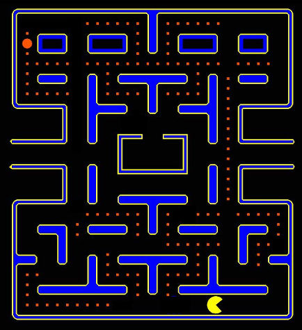

### Homework

Write a program in pseudocode that helps [Pac-Man](https://www.youtube.com/watch?v=i_OjztdQ8iw) (who
you can find in the bottom right corner) find his way in the maze to the Power Pellet (the large
orange dot in the top left corner). Bonus points if you can find a route that helps Pac-Man eat as
many Pac-dots (small orange dots) as possible on the way.

Instead of repeating "go forward, go forward, go forward", use control statements.

##### The procedures Pac-Man can do:

- take one step forward
- turn left by 90°
- turn right by 90°
- check if you hit the wall

##### The instructions (control statements) Pac-Man can understand:

- Do _some procedures_.
- If _a condition_ is true, do _some procedures_.
- If _a condition_ is true, do _some procedures_, else do _some other procedures_.
- Repeat _some procedures_ while/until _a condition_ is true.
